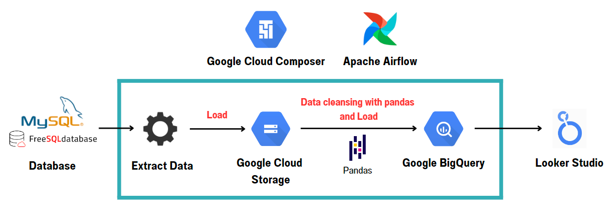
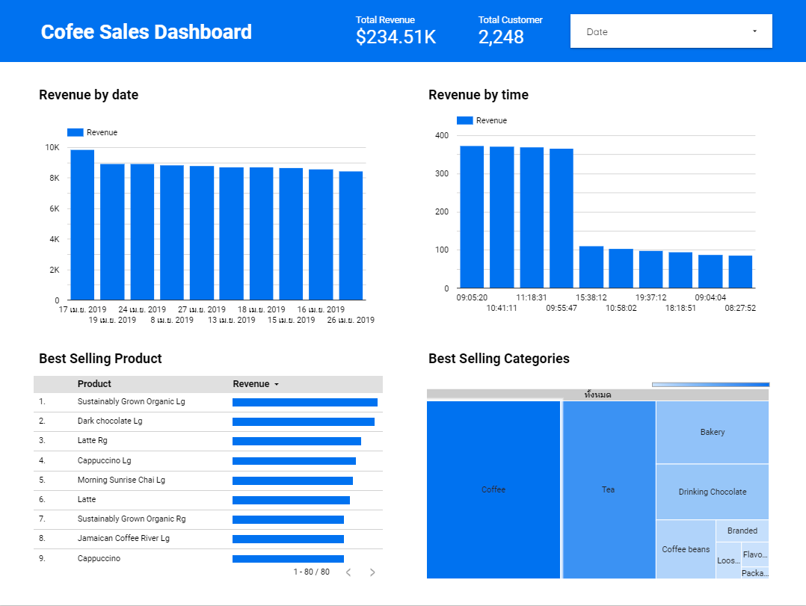

# Data Engineering Project by Google Cloud Platform
## Introduction
This is my first project to learn about data engineering. In this project it will execute an End-To-End data engineering project that consist of ETL jobs, data pipeline, and dashboard. All of them perform by using Google Cloud Platform.

### Objective
Suppose we receive requirements from business team to prepare information about product sales to know total revenue, total customer, best selling product, and best selling categories. We as data engineer need to prepare this data according to the requirements.

## Tools & Technologies
- Cloud - [**Google Cloud Platform**](https://cloud.google.com)
- Data Pipeline Orchestration - [**Apache Airflow on Cloud Composer**](https://cloud.google.com/composer?hl=en)
- Data Profiling - [**Google Colab**](https://colab.research.google.com/?hl=th)
- Data Cleasing - [**Pandas**](https://pandas.pydata.org/)
- Data Lake - [**Google Cloud Storage**](https://cloud.google.com/storage?hl=en)
- Data Warehouse - [**Google BigQuery**](https://cloud.google.com/bigquery?hl=en)
- Data Visualization - [**Looker Studio**](https://lookerstudio.google.com/u/0/navigation/reporting)
- Language - [**Python**](https://www.python.org)

## Architecture

## Dataset
The dataset that I use is coffee shop data from the website [**kaggle.com**](https://www.kaggle.com/datasets/ylchang/coffee-shop-sample-data-1113?select=201904+sales+reciepts.csv), which I have selected some tables, consisting of customer table, product table, and transaction table.

## Final Result

The result is a dashboard that answers business requirements. You can view this dashboard at this link >> [**Dashboard**](https://lookerstudio.google.com/u/0/reporting/561f032b-705d-4779-8739-06bf31ef4533/page/vSalD)

## Other
Full details and Thai version of this project is on Medium.com at this link >> [**Full version**](https://medium.com/@goodbetterz.d/%E0%B8%A5%E0%B8%AD%E0%B8%87%E0%B9%83%E0%B8%8A%E0%B9%89-gcp-%E0%B8%97%E0%B8%B3-data-engineering-project-%E0%B8%81%E0%B8%B1%E0%B8%99-f79cf9308eeb)